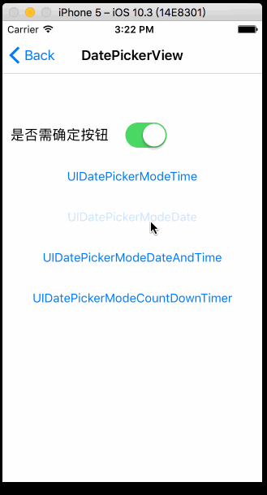

# BMPicker
>BMPicker 是一款自定义的时间选选择器，支持年，年月，年月日，年月日时，年月日时分，年月日时分秒

[](http://cocoapods.org/pods/BMPicker) 
[](http://cocoapods.org/pods/BMPicker) 
[](http://cocoapods.org/pods/BMPicker) 
[](https://www.apple.com/nl/ios/) 
[](http://weibo.com/liangdahong) 

## 效果图 



## CocoaPods
CocoaPods is the recommended way to add BMPicker to your project.
Add a pod entry for BMScan to your Podfile.

```Ruby
pod 'BMPicker', '~> 0.0.1'
```		
Second, install BMPicker into your project:

```Ruby
pod install
```

## 使用说明

## Contacts

##### Sina : [@梁大红](http://weibo.com/3205872327)
##### blog : [@idhong](http://idhong.com)
##### 有任何问题可与我联系

## License
BMScan is released under the [MIT license](LICENSE). 
